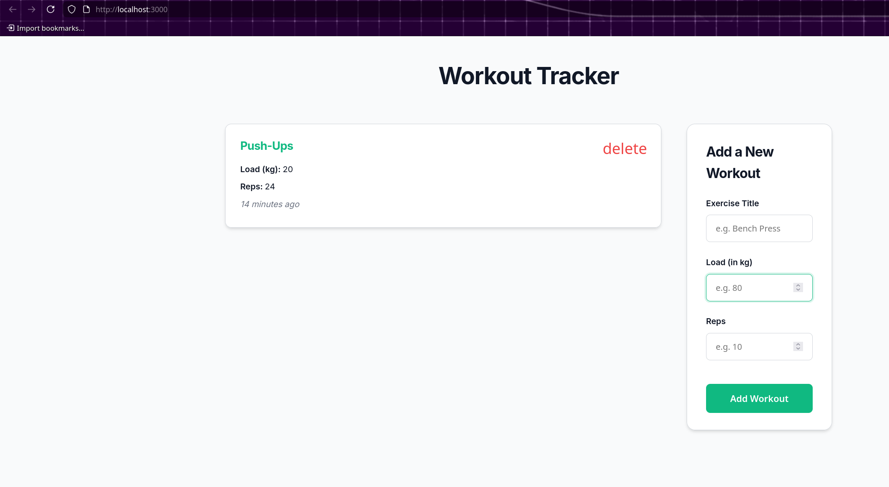

# MERN Workout Tracker

A full-stack workout tracking application built with the **MERN stack** (MongoDB, Express.js, React, Node.js).

## Features

Users can:
- View all workouts
- Add new workouts
- Delete existing workouts

## Tech Stack

- **Backend:** Node.js, Express, Mongoose, MongoDB Atlas  
- **Frontend:** React (Create React App), Context API  
- **Styling:** Plain CSS  

---

## Project Structure

```
mern-app/
├── backend/              # Node.js + Express + Mongoose API
│   ├── controllers/
│   ├── models/
│   ├── routes/
│   ├── .env              # MongoDB connection string
│   ├── server.js
│   └── package.json
└── frontend/             # React frontend (Create React App)
    ├── public/
    ├── src/
    │   ├── components/
    │   ├── context/
    │   ├── hooks/
    │   ├── App.js
    │   ├── App.css
    │   └── index.js
    └── package.json
```

---

## Prerequisites

- Node.js (v16 or higher recommended)
- npm (comes with Node.js)
- MongoDB Atlas account (free tier)

---

## Setup Instructions

### 1. Backend Setup

Go to the backend folder:

```bash
cd backend
```

Install dependencies:

```bash
npm install
```

Create a `.env` file inside `backend/` and add:

```
PORT=4000
MONGO_URI=mongodb+srv://<username>:<password>@cluster0.xxxxx.mongodb.net/workouts?retryWrites=true&w=majority
```

> Replace `<username>`, `<password>`, and cluster details with your own.

Start the backend server:

```bash
npm run dev
```

You should see:

```
connected to database
listening on port 4000
```

---

### 2. Frontend Setup

Open a new terminal and go to the frontend folder:

```bash
cd frontend
```

Install dependencies:

```bash
npm install
```

Start the React app:

```bash
npm start
```

The app will run at:

```
http://localhost:3000
```

---

## Running Both Together

Use two terminals:

**Terminal 1 – Backend**
```bash
cd backend
npm run dev
```

**Terminal 2 – Frontend**
```bash
cd frontend
npm start
```

Then open:

```
http://localhost:3000
```

## Screenshots

### Home Page


---

## Features Overview

- Add new workouts (title, reps, load)
- View all workouts with timestamps
- Delete workouts
- Real-time UI updates using React Context

---


---

## Author

Made by **Prahalad**

---

